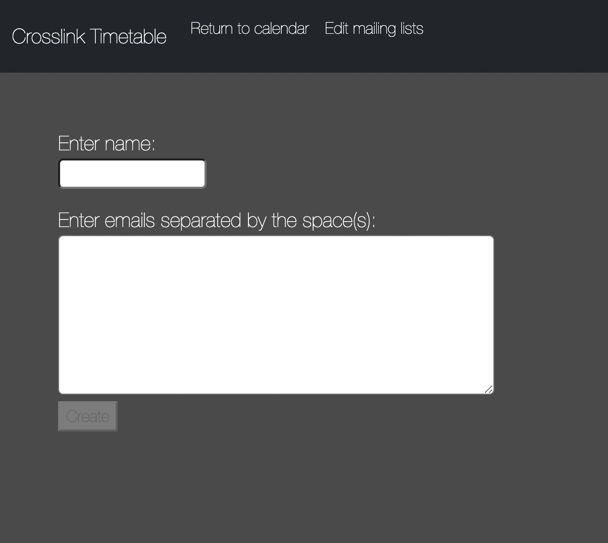
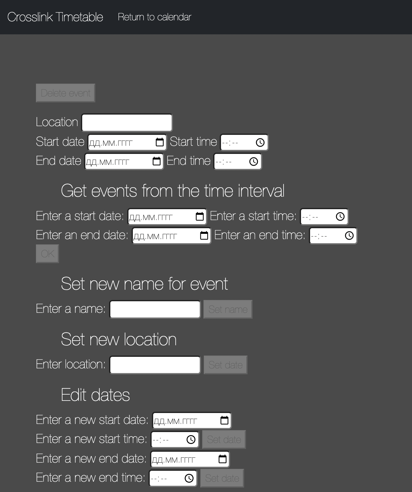
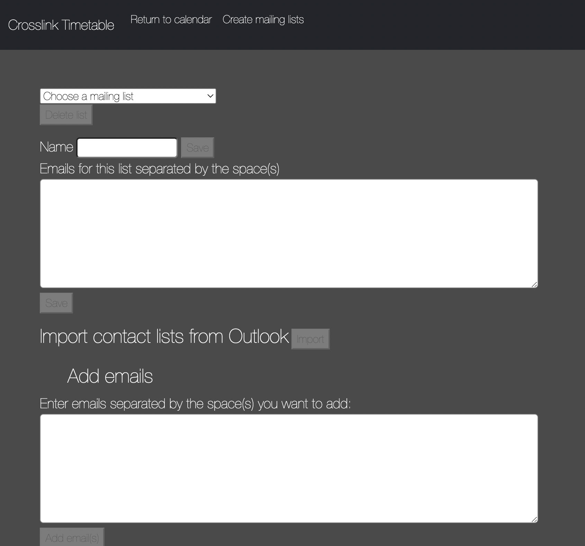
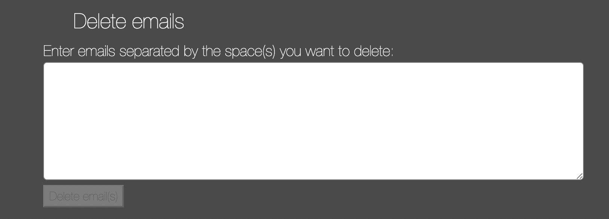

# Cross Link for University Innopolis schedules

---

This application is a combination of all `Innopolis University` timetables. With it, DoE will create events that will be sent to the calendars of students and teachers of the university. Moreover, this application combines all the events created on `Moodle and MS Exchange` and also sends them to the `Outlook calendars` of students and teachers.

## Why this important?

In `University Innopolis` there a lot of links that have some events on them(e.g. `Moodle, Outlook, MS Exchange`). So, our application unite all these timetables and send them to `Outlook Calendar`, because every participant of University Innopolis has Outlook account.

## How to use?

our application is based on the site, so just open the site and log in. 
[Event adder](https://degrassi-minister-88544.herokuapp.com/index.html)

## Features

There's some features in our application : 
1. `Adding events` to students' and teachers' calendars.
2. `Edit and Delete` already created `events`
3. `Import list of emails` from Outlook.
4. `Create list of emails` on our site.
5. `Edit and Delete` already created `mailing lists`.

## Tools

For frontend developing we used html, css and js. For backend developing of our site we used spring, docker, maven.

## Important Links

- [Usecase Diagram](https://drive.google.com/file/d/1nr23I5055SIXLq0PMvGGDPZAzz01xiW4/view?usp=sharing)
- [User Story](https://docs.google.com/spreadsheets/d/12BQN_QRp9IU6oKfjrk3xJsV7YisZib4y3s285RwqUo4/edit?usp=sharing)
- [Product Backlog](https://docs.google.com/document/d/1eF4ok6R33ai33qpmHXXPxxG4ZWCH8k8phtmZDnNVtxg/edit?usp=sharing)
- [Mock Server](https://www.postman.com/orange-astronaut-888988/workspace/timetable-api/collection/21222264-0d7b6da3-1e13-4bd9-af09-11720e694a00?ctx=documentation)
